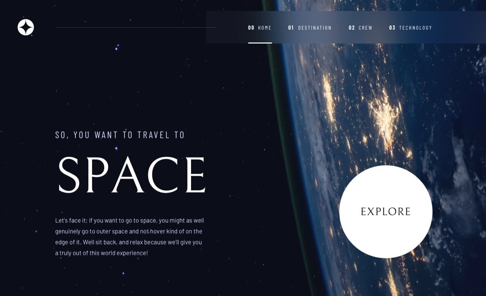
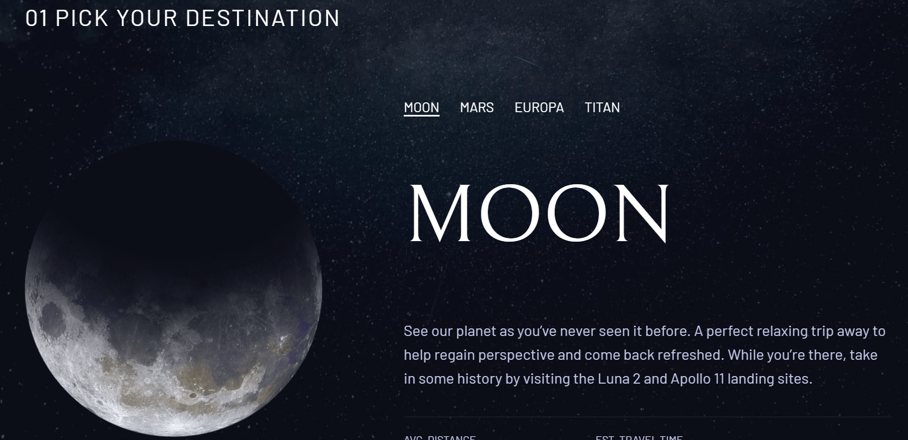
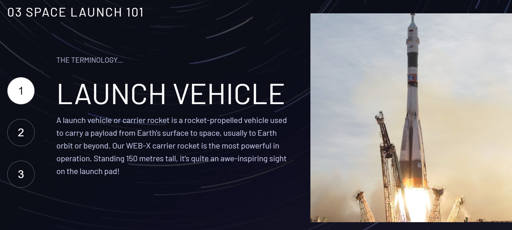
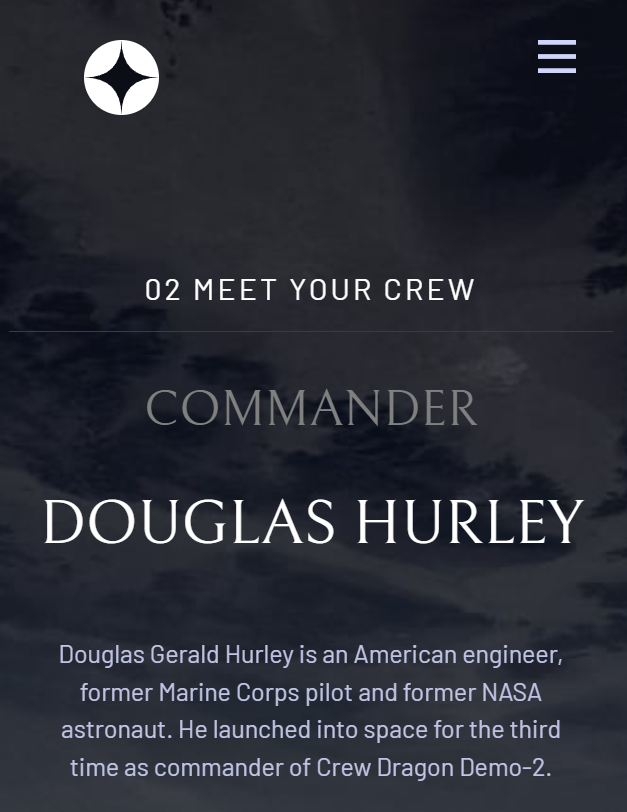

# Space tourism website

This is a multipage website project for a fictional space tourism company. The project consists of several HTML pages, CSS files, and JavaScript files to create an interactive and informative website.

## Table of contents

- [Overview](#overview)
  - [The challenge](#the-challenge)
  - [Features](#features)
  - [Screenshot](#screenshot)
  - [Links](#links)
- [My process](#my-process)
  - [Built with](#built-with)
  - [What I learned](#what-i-learned)
- [Author](#author)

## Overview

### The challenge

Users should be able to:

- View the optimal layout for each of the website's pages depending on their device's screen size
- See hover states for all interactive elements on the page
- View each page and be able to toggle between the tabs to see new information

### Features

- **Multipage Structure:** The website is organized into multiple pages for different sections: Home, Destination, Crew, and Technology.

- **Navigation Menu:** A responsive navigation menu is included for easy navigation between the pages.

- **Mobile-Friendly:** The website is designed to be responsive, ensuring a seamless experience across various screen sizes and devices.

- **Interactive Content:** JavaScript is used to provide interactivity, such as changing the displayed content on the Destination page when selecting different destinations.

- **Styling:** The CSS is used to style the website, including custom fonts, background images, and a clean, modern design.

- **Accessibility:** Appropriate ARIA attributes and roles are added for accessibility, and alt text is provided for images.

- **Hamburger Menu:** A collapsible hamburger menu for small screens is included for improved mobile usability.

### Screenshot

### Links

- Solution URL: [Add solution URL here]()
- Live Site URL: [Add live site URL here]()

## My process

### Built with

- Semantic HTML5 markup
- CSS custom properties
- Flexbox
- JavaScript
- Responsiveness

### What I learned

- **HTML and CSS:** Improved my HTML and CSS skills for structuring web pages and creating visually appealing designs.

- **JavaScript:** Gained experience in using JavaScript to add dynamic features and interactivity to web pages.

- **Responsive Design:** Learned how to make web pages responsive for different devices by using media queries.

- **Accessibility:** Increased awareness of the importance of web accessibility and added accessibility features to the site.

- **Version Control:** Utilized Git and GitHub for version control and project collaboration.

## Author

- Website - [Neooo17]()
- Frontend Mentor - [@Neoo17]()

